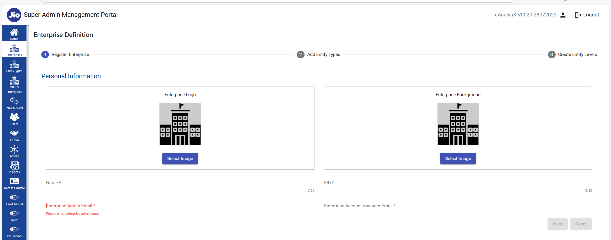

# How to Create an Enterprise

> A step‑by‑step guide to setting up your enterprise in the system.

## 📋 Prerequisites

- Gather the following details:
  - **Enterprise Name**
  - **Enterprise EID**
  - **Enterprise Admin Email**
  - **Enterprise Account Manager Email**
  - **(optional) Enterprise LOGO**
  - **(Optional) Enterprise Background**
 
 fill the below form

 

## 🚀 Steps

1. **Log in** to your admin portal.
2. Navigate to **Enterprises → Create New**.
3. Fill in the **Enterprise Name** and **Region** fields.
4. Enter **Billing Information**:
   - Account number
   - Tax ID
5. Add the **Primary Contact** details.
6. Click **Submit**.
7. You’ll see a success banner—click **View Enterprise** to verify.

## ✅ Next Steps
- Add users under this enterprise.
- Configure dashboards & KPIs.
- Set up notifications and roles.

---
*Last updated: YYYY‑MM‑DD*